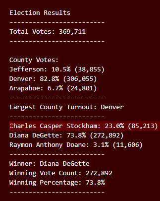

# Election Analysis
## Overview
The purpose of this election audit analysis is to provide data to the election commission regarding voter turnout for each county, percentage of votes for each county out of the total count, and the county with the highest turnout.
## Result
1. Total votes

  -	369,711

2.	Counties

  -	Jefferson
  
  -	Denver
  
  -	Arapahoe

3.	Number of votes and percentage of overall votes for each county

  -	Jefferson: 38,855 votes, 10.5% of total votes

  -	Denver: 306,055 votes, 82.8% of total votes

  -	Arapahoe: 24,801 votes, 6.7% of total votes

4.	County with the largest number of votes

  -	Denver

5.	Candidates

  -	Charles Casper Stockham

  -	Diana DeGette

  -	Raymon Anthony Doane

6.	Number of votes and percentage of overall votes for each candidate

  -	Charles Casper Stockham: 85,213 total votes, 23.0% of total votes

  -	Diana DeGette: 272,892 total votes, 73.8% of total votes

  -	Raymon Anthony Doane: 11,606 total votes, 3.1% of total votes

7.	Winning candidate

  -	Diana DeGette

  -	Total Votes: 272,892

  -	Percentage of total votes: 73.8%

## Summary
This script can be used for an election of any kind. If you wanted to use this for the presidential election all you would have to do is change the counties to the states. You could also use this to track votes on local propositions; instead of candidates you would have “in favor of” or “against”.

